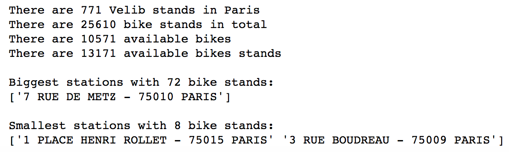
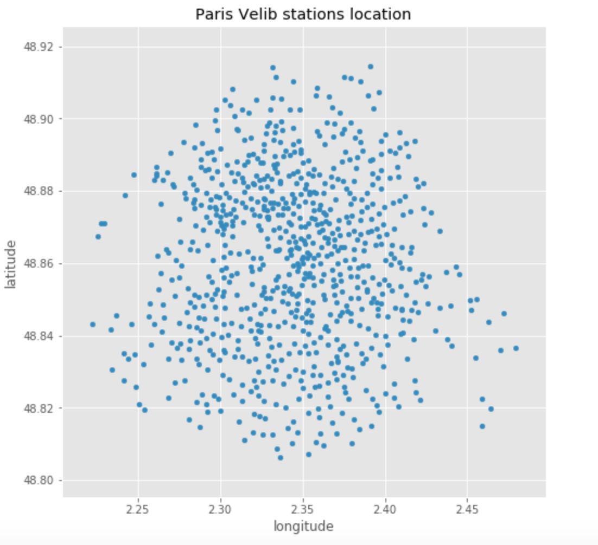
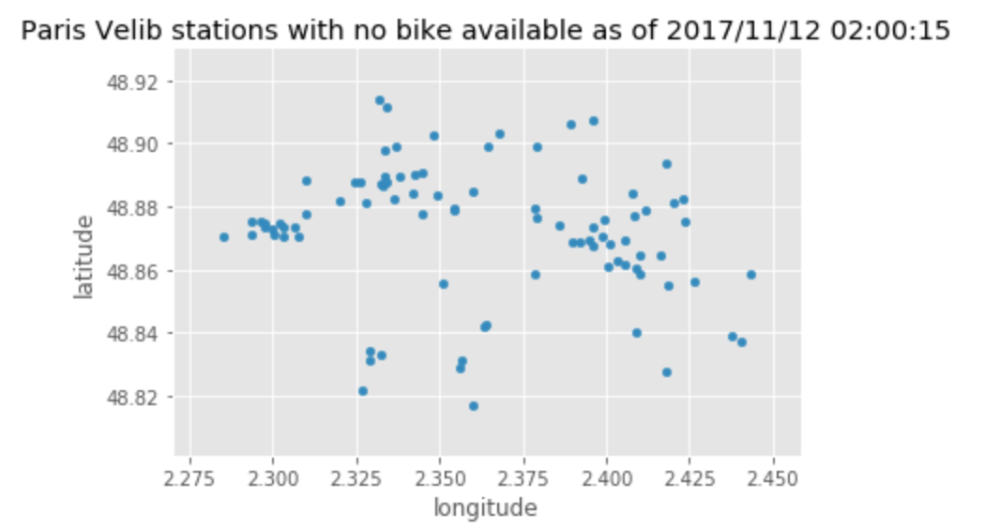

# velib-fun

Playing with jupyter notebook, python, pandas dataframes, matplotlib and folium for fun.

Results obtained with the notebook and JC Decaux open data api (as of 12/11/2017):
___
Some stats:
 </img>

___

Graph Velib stands locations:
 </img>
___

Number of Bike per stand:
 </img>
___

Number of station per postcode:
 </img>

___

Stations with no bike available:
 </img>

___

Bike availability in percent:
 </img>
___

Bike availability heatmap:
 </img>
___

Stations with Bonus (if you climb to montmartre or belleville and leave your bike there your account gets a bonus):
 </img>

___

Prerequisites:
- install anaconda (python 3) 
- pip install folium (to draw nice maps)
- Free dev Key from JC Decaux ( https://developer.jcdecaux.com/#/opendata/vls?page=dynamic ) 

Inspired from:
- https://flothesof.github.io/paris-velib-bokeh-pandas.html
- http://nbviewer.jupyter.org/gist/rossant/5520933
